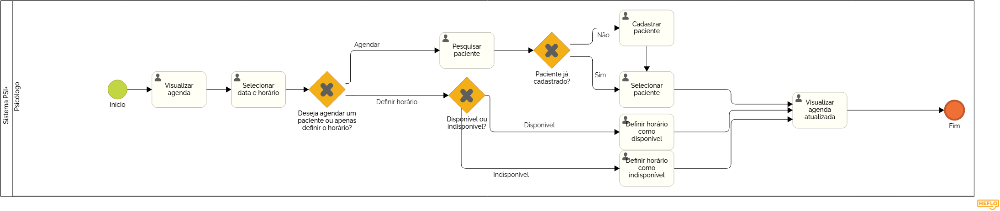

### 3.3.1 Processo 1 – Cadastro da agenda
O processo de agendamento no Psi+ permite que psicólogos cadastrem horários como disponíveis, indisponíveis ou cadastrar um paciente à ele. O processo se inicia com a visualização da agenda de acordo com atualizações passadas, onde o paciente selecionará um horário e o definirá da forma que preferir, e, ao final do processo, a agenda estará atualizada.

**Visualizar Agenda**

| **Campo**       | **Tipo**         | **Restrições** | **Valor default** |
| ---             | ---              | ---            | ---               |
| [Nome do campo] | [tipo de dados]  |                |                   |
| tempoExpediente       | Hora      |hh:mm|                   |
| horarioAlmoco       | Hora      |hh:mm|                   |
| tempoEntreSessoes       | Hora      |hh:mm|                   |
| duracaoConsulta       | Hora      |hh:mm|                   |

| **Comandos**         |  **Destino**                   | **Tipo**          |
| ---                  | ---                            | ---               |
| novoPaciente                | Enviar para Processo Cadastar Paciente| ---               |
| novaConsulta                | Enviar para Processo Cadastar Consulta| ---               |

**Selecionar Data e Horario, Pesquisar paciente, Cadastrar paciente, Selecionar paciente, Definir como horário disponível, Definir como horário indisponível**
| **Campo**       | **Tipo**         | **Restrições** | **Valor default** |
| ---             | ---              | ---            | ---               |
| [Nome do campo] | [tipo de dados]  |                |                   |
| dataehora       | Data e Hora      |dd-mm-aaaa, hh:mm|                   |
| definirComoIndisponivelOuDisponivel       | Seleção unica      ||                   |
| selecionarPaciente       | Seleção unica      ||                   |

| **Comandos**         |  **Destino**                   | **Tipo**          |
| ---                  | ---                            | ---               |
| criarPaciente       | Enviar para processo de criar paciente      ||                   |
| salvar | Horário é atualizado | default|
| cancelar| Processo é cancelado |cancel|

**Visualizar Agenda atualizada**

| **Campo**       | **Tipo**         | **Restrições** | **Valor default** |
| ---             | ---              | ---            | ---               |
| [Nome do campo] | [tipo de dados]  |                |                   |
| tempoExpediente       | Hora      |hh:mm|                   |
| horarioAlmoco       | Hora      |hh:mm|                   |
| tempoEntreSessoes       | Hora      |hh:mm|                   |
| duracaoConsulta       | Hora      |hh:mm|                   |

| **Comandos**         |  **Destino**                   | **Tipo**          |
| ---                  | ---                            | ---               |
| novoPaciente                | Enviar para Processo Cadastar Paciente| ---               |
| novaConsulta                | Enviar para Processo Cadastar Consulta| ---               |
