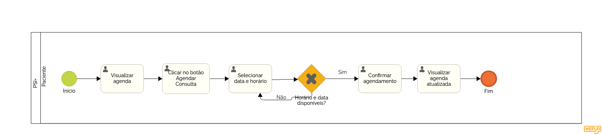

### 3.3.2 Processo 2 – Agendamento de horários

O processo de agendamento de horários por parte do paciente se inicia na visualização da agenda atualizada, onde o usuário pode clicar em um botão e ser levado para uma tela de confirmação podendo confirmar ou cancelar a operação.

**Visualizar agenda**

| **Comandos**         |  **Destino**                   | **Tipo**          |
| ---                  | ---                            | ---               |
| agendarConsulta                | Abrir popup de agendamento| ---               |
| botaoEmocoes                | Ir para o processo Gestao das emocoes| ---               |

**Selecionar data e hora, Confirmar agendamento**
| **Campo**       | **Tipo**         | **Restrições** | **Valor default** |
| ---             | ---              | ---            | ---               |
| [Nome do campo] | [tipo de dados]  |                |                   |
| dataehora       | Data e Hora      |dd-mm-aaaa, hh:mm|                   |

| **Comandos**         |  **Destino**                   | **Tipo**          |
| ---                  | ---                            | ---               |
| confirmar | Horário é reservado para o paciente | default|
| cancelar| Processo é cancelado |cancel|

**Visualizar agenda atualizada**

| **Comandos**         |  **Destino**                   | **Tipo**          |
| ---                  | ---                            | ---               |
| agendarConsulta                | Abrir popup de agendamento| ---               |
| botaoEmocoes                | Ir para o processo Gestao das emocoes| ---               |
