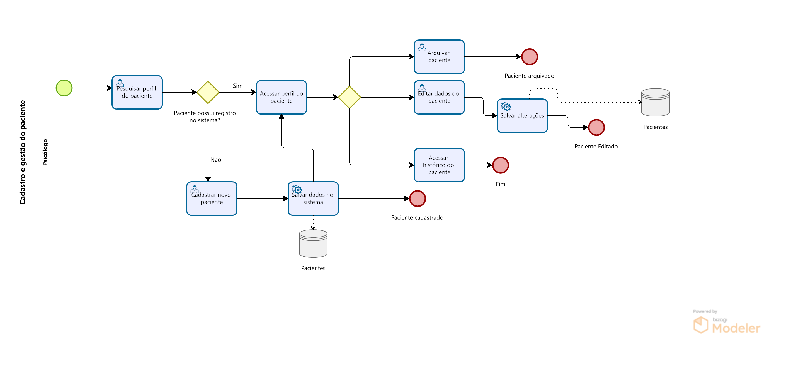
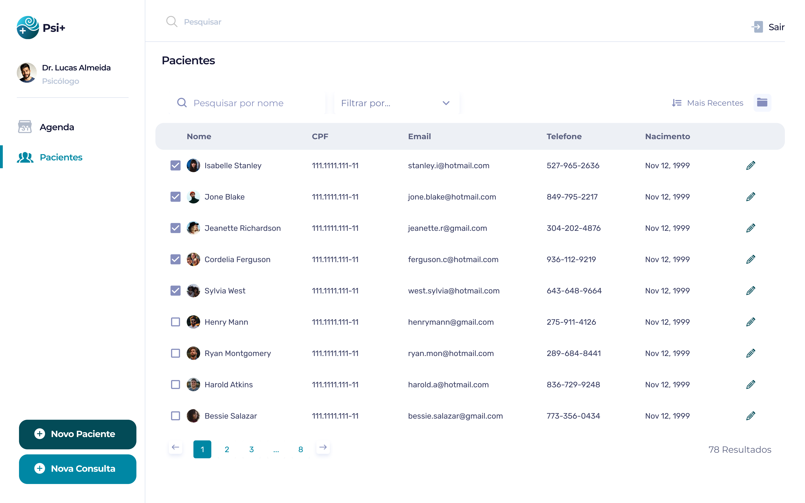
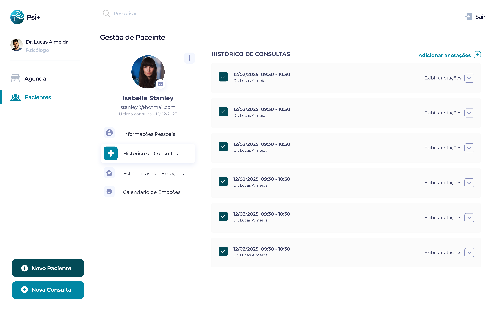
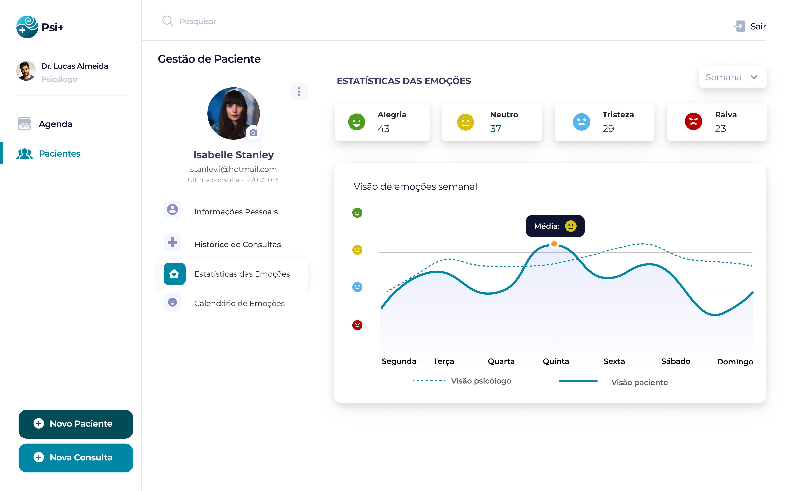
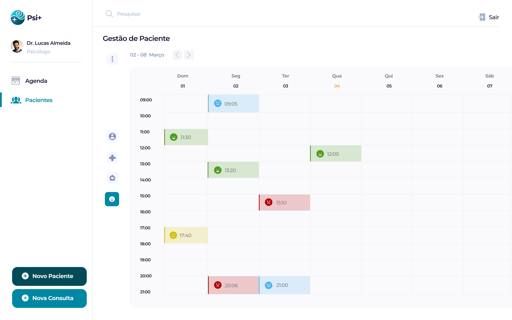

### 3.3.3 Processo 3 – Cadastro e Gestão do paciente

O processo de Cadastro e Gestão do Paciente permite a organização e atualização dos dados dos pacientes, garantindo um atendimento eficiente e seguro. No cadastro, são registradas informações pessoais, endereço residencial e informações complementares. Já a gestão acompanha o histórico de consultas, as estatísticas das emoções e a visualização do calendário de emoções. Além disso, é possível editar os dados do paciente ou arquivá-lo quando necessário. Esse processo melhora o atendimento, otimiza o fluxo de trabalho e garante a segurança das informações.

### Detalhamento das atividades

**Cadastro de Paciente**

| **Campo**       | **Tipo**         | **Restrições** | **Valor default** |
| ---             | ---              | ----           | ---               |
| Nome            | Caixa de texto   | Obrigatório    | -                 |
| Data de Nascimento  | Data                 | Obrigatório (dd-mm-aaaa)               | -                  |
| Telefone           | Número   | Obrigatório, formato (XX) XXXXX-XXXX | -               |
| Gênero           | Seleção única   | Masculino/Feminino/Outro | -               |
| CPF          | Caixa de Texto   | Formato: 000.000.000-00 | -          |
| E-mail          | Caixa de Texto   | Formato de e-mail válido | -          |
| Endereço           | Área de Texto   | Opcional | -               |
| Observações          | Área de Texto   | Opcional | -          |

| **Comandos**         |  **Destino**                   | **Tipo** |
| ---                  | ---                            | ---               |
| Salvar               | Confirma o cadastro e armazena os dados              | default           |
| Cancelar            | Descarta a ação e retorna à tela inicial  | Cancel                  |

**Pesquisa de Perfil do Paciente**

| **Campo**       | **Tipo**         | **Restrições** | **Valor default** |
| ---             | ---              | ----           | ---               |
| Nome            | Caixa de texto   | Obrigatório    | -                 |
| CPF          | Caixa de Texto   | Formato: 000.000.000-00 | -          |

| **Comandos**         |  **Destino**                   | **Tipo** |
| ---                  | ---                            | ---               |
| Pesquisar              | Confirma a pesquisa e exibe os resultados correspondentes             | default           |
| Cancelar            | Descarta a pesquisa e retorna à tela inicial  | Cancel                  |

**Arquivamento de Paciente**

| **Campo**       | **Tipo**         | **Restrições** | **Valor default** |
| ---             | ---              | ----           | ---               |
| Status do Paciente   | Seleção Única   | Ativo / Arquivado   | Ativo                |

| **Comandos**         |  **Destino**                   | **Tipo** |
| ---                  | ---                            | ---               |
| Arquivar               | Altera o status para "Arquivado"              | default           |
| Cancelar            | Mantém o status atual  | cancel                  |

**Atualização de Dados do Paciente**

| **Campo**       | **Tipo**         | **Restrições** | **Valor default** |
| ---             | ---              | ----           | ---               |
| Nome            | Caixa de texto   | Editável    | -                 |
| Data de Nascimento  | Data                 | Editável (dd-mm-aaaa)               | -                  |
| Gênero           | Seleção única   | Masculino/Feminino/Outro | -               |
| Telefone           | Número   | Editável, formato (XX) XXXXX-XXXX | -               |
| E-mail          | Caixa de Texto   | Formato de e-mail válido | -          |
| Endereço           | Área de Texto   | Opcional | -               |
| Observações          | Área de Texto   | Opcional | -          |

| **Comandos**         |  **Destino**                   | **Tipo** |
| ---                  | ---                            | ---               |
| Atualizar               | Confirma as alterações              | default           |
| Cancelar            | Descarta mudanças  | cancel                  |

**Consulta ao Histórico Clínico**

| **Campo**       | **Tipo**         | **Restrições** | **Valor default** |
| ---             | ---              | ----           | ---               |
| Data da Consulta            | Data   | Obrigatório    | -                 |
| Anotações  | Área de Texto                 | Somente leitura               | -                  |
| Diagnóstico           | Área de Texto   | Somente leitura | -               |

| **Comandos**         |  **Destino**                   | **Tipo** |
| ---                  | ---                            | ---               |
| Visualizar               | Exibe o histórico do paciente              | default           |
| Fechar            | Sai da tela sem alterar dados  | cancel                  |

