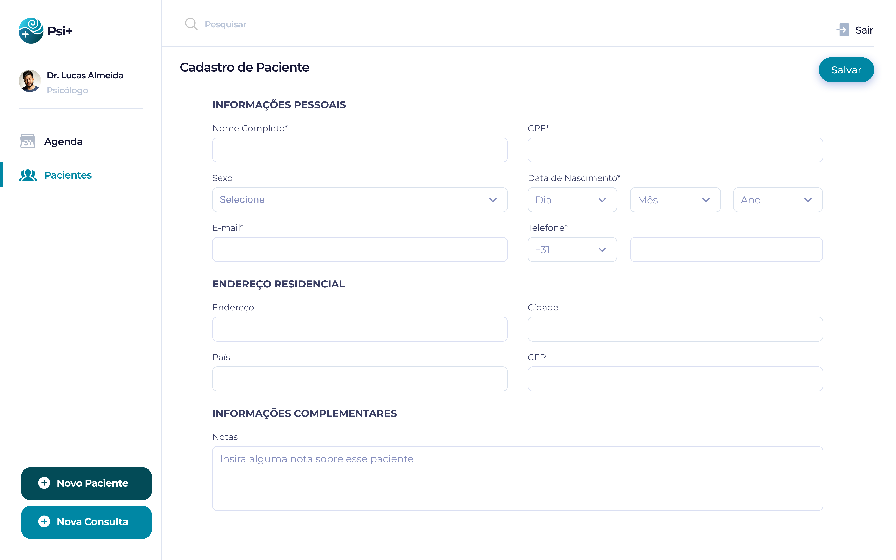
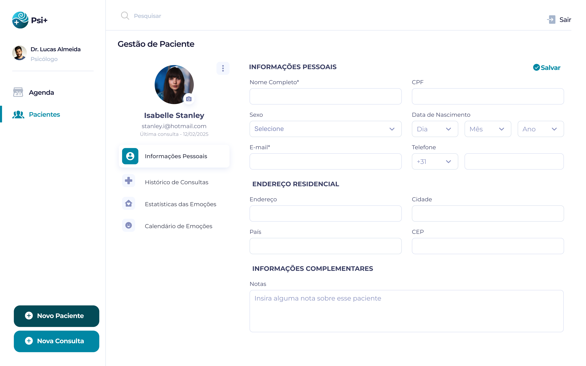

### 3.3.3 Processo 3 – Cadastro e Gestão do paciente

O processo de Cadastro e Gestão do Paciente permite a organização e atualização dos dados dos pacientes, garantindo um atendimento eficiente e seguro. No cadastro, são registradas informações pessoais, endereço residencial e informações complementares. Já a gestão acompanha o histórico de consultas, as estatísticas das emoções e a visualização do calendário de emoções. Além disso, é possível editar os dados do paciente ou arquivá-lo quando necessário. Esse processo melhora o atendimento, otimiza o fluxo de trabalho e garante a segurança das informações.

---  
### Detalhamento das atividades

**Cadastro de Paciente**

| **Campo**       | **Tipo**         | **Restrições** | **Valor default** |
| ---             | ---              | ----           | ---               |
| Nome            | Caixa de texto   | Obrigatório    | -                 |
| CPF             | Caixa de Texto   | Obrigatório/Formato: 000.000.000-00 | -          |
| Data de Nascimento  | Seleção única                 | Obrigatório Dia/Mes/Ano  | -                  |
| Telefone        | Número   | Obrigatório, formato (XX) XXXXX-XXXX | -               |
| Sexo            | Seleção única   | Masculino/Feminino/Outro | -               |
| E-mail          | Caixa de Texto   | Obrigatório/Formato de e-mail válido | -          |
| Endereço        | Área de Texto   | Opcional | -               |
| Cidade          | Área de Texto   | Opcional | -               |
| País            | Seleção única   | Opcional/Países | -               |
| CEP             | Área de Texto   | Opcional | -               |
| Notas           | Área de Texto   | Opcional | -          |

| **Comandos**         |  **Destino**                   | **Tipo** |
| ---                  | ---                            | ---               |
| Salvar               | Confirma o cadastro e armazena os dados              | default           |

---  
**Pesquisa de Perfil do Paciente**

| **Campo**       | **Tipo**         | **Restrições** | **Valor default** |
| ---             | ---              | ----           | ---               |
| Pesquisar paciente   | Caixa de texto   | Nome/CPF/E-mail/Telefone/Nascimento    | -                 |

| **Comandos**         |  **Destino**                   | **Tipo** |
| ---                  | ---                            | ---               |
| Mais Recentes        | Filtra e organiza os pacientes do cadastro mais recente para o mais antigo             | Filtro |

**Arquivamento de Paciente**

| **Campo**       | **Tipo**         | **Restrições** | **Valor default** |
| ---             | ---              | ----           | ---               |
| Seleção de Paciente   | Checkbox (múltipla)   | Permite selecionar um ou mais pacientes para arquivar   | Ativo                |

| **Comandos**         |  **Destino**                   | **Tipo** |
| ---                  | ---                            | ---               |
| Arquivar             | Move os pacientes selecionados para a página "Pacientes Arquivados"              | Lista de Arquivados          |

---  
**Atualização de Dados do Paciente**

| **Campo**       | **Tipo**         | **Restrições** | **Valor default** |
| ---             | ---              | ----           | ---               |
| Nome            | Caixa de texto   | Obrigatório    | -                 |
| CPF             | Caixa de Texto   | Obrigatório/Formato: 000.000.000-00 | -          |
| Data de Nascimento  | Seleção única                 | Obrigatório Dia/Mes/Ano  | -                  |
| Telefone        | Número   | Obrigatório, formato (XX) XXXXX-XXXX | -               |
| Sexo            | Seleção única   | Masculino/Feminino/Outro | -               |
| E-mail          | Caixa de Texto   | Obrigatório/Formato de e-mail válido | -          |
| Endereço        | Área de Texto   | Opcional | -               |
| Cidade          | Área de Texto   | Opcional | -               |
| País            | Seleção única   | Opcional/Países | -               |
| CEP             | Área de Texto   | Opcional | -               |
| Notas           | Área de Texto   | Opcional | -          |

| **Comandos**         |  **Destino**                   | **Tipo** |
| ---                  | ---                            | ---               |
| Salvar               | Confirma a alteração e armazena os dados              | default           |

---  
**Consulta ao Histórico Clínico**

| **Campo**       | **Tipo**         | **Restrições** | **Valor default** |
| ---             | ---              | ----           | ---               |
| Histórico da consulta     | Data   | Obrigatório    | -                 |
| Estatísticas das Emoções  | Área de Texto                 | Somente leitura               | -                  |
| Calendário de Emoções     | Área de Texto   | Somente leitura | -               |

| **Comandos**         |  **Destino**                   | **Tipo** |
| ---                  | ---                            | ---               |
| Visualizar               | Exibe o histórico do paciente              | default           |
| Fechar            | Sai da tela sem alterar dados  | cancel                  |

