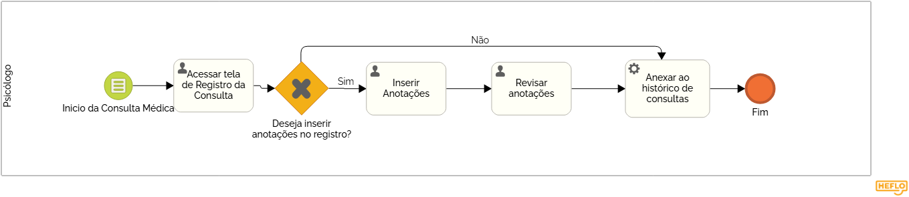
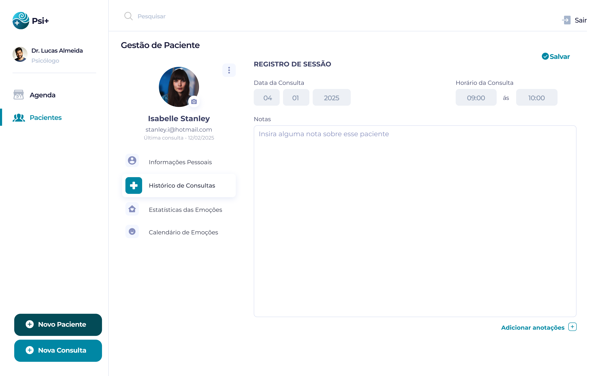

### 3.3.4 Processo 4 – Registro de Anotações da Consulta

O processo permite que os profissionais registrem informações importantes sobre as consultas realizadas. Após o atendimento, o médico ou psicólogo pode inserir anotações, revisá-las e armazená-las no sistema. Caso não haja necessidade de anotações, o processo é finalizado diretamente. O sistema garante a organização eficiente dos registros, facilitando o acompanhamento do histórico do paciente.  

  

---

## Detalhamento das atividades

| **Campo**             | **Tipo**       | **Restrições**                   | **Valor default**     |  
|----------------------|---------------|---------------------------------|----------------------|  
| visualizarAnotacoes | Área de Texto  | Somente leitura                 | Anotações feitas    |  
| inserirAnotacoes    | Botão          | Permite inserir novas anotações | - |  
| campoAnotacoes      | Área de Texto  | Entrada de usuário              | - |  

### **Verificar Existência de Anotações (Gateway Exclusivo – XOR)**  

- **Se houver anotações**, seguir para **Revisar Anotações**.  
- **Se não houver anotações**, seguir diretamente para **Finalizar Registro**.  

---
### **Wireframe do processo e tela**  

  

