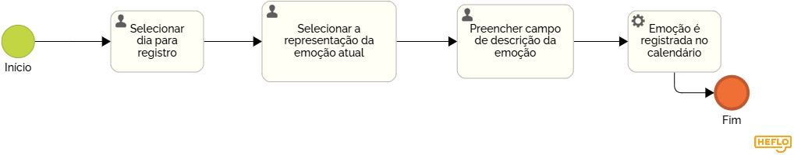

### 3.3.4 Processo 4 – Registro das emoções e calendário

O sistema disponibiliza uma página dedicada para o paciente registrar suas emoções diariamente e visualizar esses registros de forma organizada em um calendário. A ferramenta possibilita ao paciente acompanhar sua jornada emocional ao longo do tempo, identificando padrões e momentos específicos de maior impacto emocional. Além disso, o calendário facilita a visualização dos dias em que os registros foram feitos, permitindo um controle mais ativo do próprio processo terapêutico e fornecendo informações valiosas para o psicólogo durante as sessões.

**Cadastro de Emoção**

| **Campo**       | **Tipo**         | **Restrições** | **Valor default** |
| ---             | ---              | ---            | ---               |
| dia_selecionado | Seleção única    |  Obrigatório   |   Hoje            |
| emoção_atual    | Seleção única    |  Obrigatório (Raiva, Muito triste, triste, neutro, feliz, muito feliz)   |   Neutro          |
| descrição       | Caixa de Texto   | Obrigatório    | ---               |

| **Comandos**         |  **Destino**                   | **Tipo** |
| ---                  | ---                            | ---               |
| registrar            | Adiciona o registro no banco   | default           |
| cancelar             | Cancela o registro             | cancel            |

**Alteração de visualização do gráfico**

| **Campo**       | **Tipo**         | **Restrições** | **Valor default** |
| ---             | ---              | ---            | ---               |
| Alteração de Visualização | Seleção única  |  Opcional              |   Semanal               |
