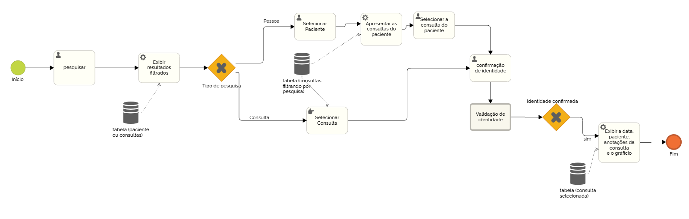

### 3.3.5 Processo 5 – Gestão do Registro de Anotações da Consulta

O processo permite que os profissionais consultem registros, informações importantes sobre as consultas realizadas. O sistema garante a organização eficiente dos registros, facilitando o acompanhamento do histórico do paciente.  

  

## Detalhamento das atividades  

### **Pesquisar**  

| **Campo** | **Tipo** | **Restrições** | **Valor default** |
| --- | --- | --- | --- |
| Pesquisar | Área de texto | obrigatório | - |

| **Comandos** | **Destino** | **Tipo** |
| --- | --- | --- |
| Icone pesquisar | Processo "Exibir resultados filtrados" | Tabela |
---

### **Selecionar um dos resultados exibidos**  

| **Comandos** | **Destino** | **Tipo** |
| --- | --- | --- |
| Selecionar | Gráficos e anotações | Tabela |

