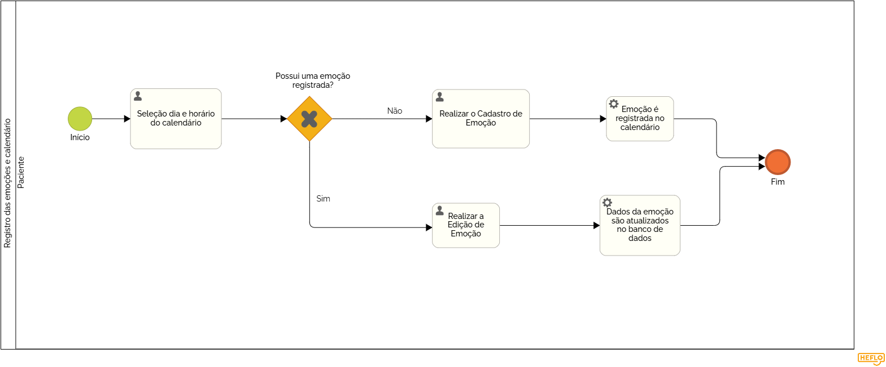
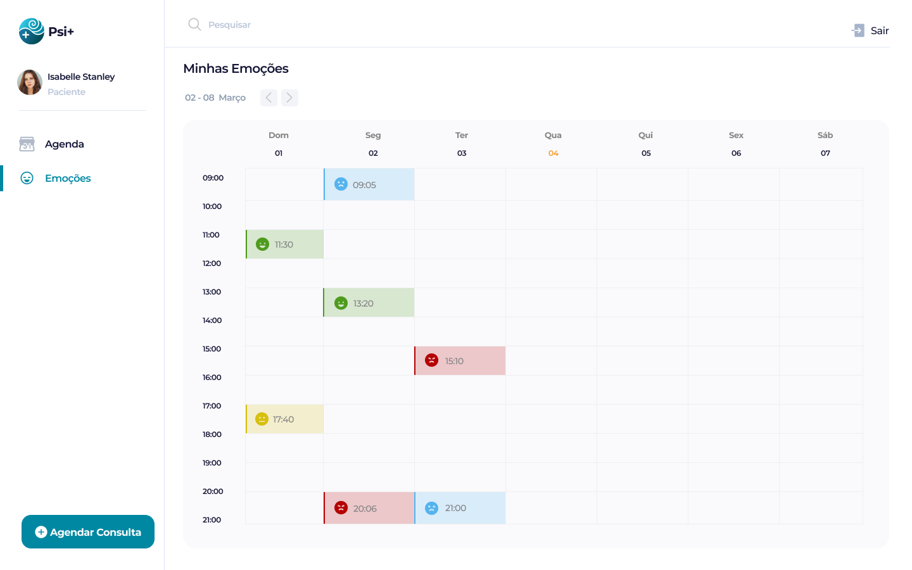

### 3.3.6 Processo 6 – Gestão das emoções e calendário

O sistema disponibiliza uma página dedicada para o paciente registrar suas emoções diariamente e visualizar esses registros de forma organizada em um calendário. A ferramenta possibilita ao paciente acompanhar sua jornada emocional ao longo do tempo, identificando padrões e momentos específicos de maior impacto emocional. Além disso, o calendário facilita a visualização dos dias em que os registros foram feitos, permitindo um controle mais ativo do próprio processo terapêutico e fornecendo informações valiosas para o psicólogo durante as sessões.

---  
## Detalhamento das atividades

### Psicólogo

**Calendário de Emoções do Paciente**

| **Campo**       | **Tipo**         | **Restrições** | **Valor default** |
| ---             | ---              | ---            | ---               |
| Selecionar emoção para visualizar | Tabela  |  Opcional              |   ---               |

| **Comandos**         |  **Destino**                   | **Tipo** |
| ---                  | ---                            | ---               |
| Histórico de consultas     | Exibe o histórico de consultas do paciente    | Navegação             |
| Estatísticas das Emoções  | Exibe as estatísticas das emoções do paciente | Navegação             |
| Calendário de Emoções     | Exibe o calendário de emoções do paciente     | Navegação             |
| Novo Paciente     | Envia para a tela de cadastro de novo paciente     | Navegação             |
| Nova Consulta     | Envia para a tela de cadastro de nova consulta     | Navegação             |
| Agenda     | Envia para a tela de agenda     | Navegação             |
| Pacientes     | Envia para a tela de pacientes     | Navegação             |

**Emoção do Paciente**

| **Comandos**         |  **Destino**                   | **Tipo** |
| ---                  | ---                            | ---               |
| Fechar             | Cancela a visualização da emoção             | cancel            ||

**Estatísticas de Emoções do Paciente**

| **Comandos**         |  **Destino**                   | **Tipo** |
| ---                  | ---                            | ---               |
| Histórico de consultas     | Exibe o histórico de consultas do paciente    | Navegação             |
| Estatísticas das Emoções  | Exibe as estatísticas das emoções do paciente | Navegação             |
| Calendário de Emoções     | Exibe o calendário de emoções do paciente     | Navegação             |
| Novo Paciente     | Envia para a tela de cadastro de novo paciente     | Navegação             |
| Nova Consulta     | Envia para a tela de cadastro de nova consulta     | Navegação             |
| Agenda     | Envia para a tela de agenda     | Navegação             |
| Pacientes     | Envia para a tela de pacientes     | Navegação             |

---
### Paciente

**Calendário de Emoções**

| **Campo**       | **Tipo**         | **Restrições** | **Valor default** |
| ---             | ---              | ---            | ---               |
| Selecionar dia para gestão | Tabela  |  Opcional              |   ---               |

| **Comandos**         |  **Destino**                   | **Tipo** |
| ---                  | ---                            | ---               |
| Agenda     | Envia para a tela de agenda     | Navegação             |
| Emoções     | Exibe o calendário de emoções do paciente     | Navegação             |
| Agendar Consulta     | Envia para a tela de agendamento de consulta     | Navegação             |
| Seleção emoção     | Envia para a tela de edição de emoção     | Navegação             |
| Seleção dia     | Envia para a tela de cadastro de emoção     | Navegação             |

**Cadastro de Emoção**

| **Campo**       | **Tipo**         | **Restrições** | **Valor default** |
| ---             | ---              | ---            | ---               |
| Emoção Diária    | Seleção única    |  Obrigatório (Raiva, Triste, Neutro, Feliz)   |   Neutro          |
| Dia e Horário | Data-Hora    |  Obrigatório   |   Hoje            |
| Descrição       | Caixa de Texto   | Obrigatório    | ---               |
| Nota       | Caixa de Texto   | Obrigatório    | ---               |

| **Comandos**         |  **Destino**                   | **Tipo** |
| ---                  | ---                            | ---               |
| Salvar            | Adiciona a emoção no banco   | default           |
| Cancelar             | Cancela a gestão da emoção             | cancel            |

**Edição de Emoção**

| **Campo**       | **Tipo**         | **Restrições** | **Valor default** |
| ---             | ---              | ---            | ---               |
| Emoção Diária    | Seleção única    |  Obrigatório (Raiva, Triste, Neutro, Feliz)   |   (Pré-preenchido do banco de dados)          |
| Dia e Horário | Data-Hora    |  Obrigatório   |   (Pré-preenchido do banco de dados)            |
| Descrição       | Caixa de Texto   | Obrigatório    | (Pré-preenchido do banco de dados)               |
| Nota       | Caixa de Texto   | Obrigatório    | (Pré-preenchido do banco de dados)               |

| **Comandos**         |  **Destino**                   | **Tipo** |
| ---                  | ---                            | ---               |
| Editar Emoção            | Salva os novos dados da emoção no banco   | default           |
| Deletar Emoção            | Remove os dados da emoção do banco   | remover           |
| Cancelar             | Cancela a edição da emoção             | cancel            |
